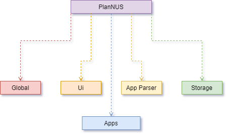

# Developer Guide

Before reading this document, you are recommended to read through the user guide.

* Table of contents
{:toc}

## Setting up PlanNUS

First and foremost, the following steps are assuming that you already have a [GitHub](github.com) account set up beforehand. Once this has been done, proceed to __fork__ this [repo](https://github.com/AY2021S1-CS2113T-F12-1/tp), and __clone__ the fork into your computer using [Sourcetree](<sourcetreeapp.com>) or any other _Git GUI_.

The _IDE_ to be used should contain the latest version of _Java_ as this is the main programming language for this application. Thus you are highly recommended to use Intellij IDEA.

The following are remaining steps to be taken to finish the set up:

1. Make sure that the version is configured as __JDK 11__.
2. When prompted, __import__ the project as a __Gradle project__ (could take minutes to complete).
3. Enter commands to ensure that PlanNUS functions as expected. You may refer to the _User Guide_ for valid commands.

## Design

### Architecture

The ***Architecture Diagram*** given above explains the high-level design of PlanNus. Below is a quick overview of each component.

#### PlanNus

`PlanNus` class contains the `main` and `run` method, which is responsible for

  * At launch

       * Loading all modules for AY2020/21 into PlanNus

       * Loading previous save file into PlanNus if available

       * Creation of entry point to available app in PlanNus

  * While running

       * Continuously prompt user for app selection

  * At shut down

       * Saving of user data into save file
       * Clean up methods where necessary

#### Global, Ui, Parser, Storage

* The `global` package contains classes, exceptions and objects that are required across the whole app. 
* The `ui` package contains the class that is responsible for sharing one `scanner` class across the whole app to prevent multiple IO streams
* The `parser` package contains the class that handles user's app selection
* The `storage` package handles loading and saving of user's data to a save file.

### UI component

### Logic component

{Exact diagram and corresponding descriptions to be added}

### Model component

{Exact diagram and corresponding descriptions to be added}

### Storage component

{Exact diagram and corresponding descriptions to be added}

### Common classes

{Exact diagram and corresponding descriptions to be added}

## Implementation

### Academic Calendar Planner features (i.e. add, remove, edit and view)

#### Proposed implementation

{Exact diagram and corresponding descriptions to be added}

#### Design consideration

{Exact diagram and corresponding descriptions to be added}

### CAP Calculator features (i.e. current and set target)

#### Proposed implementation

{Exact diagram and corresponding descriptions to be added}

#### Design consideration

{Exact diagram and corresponding descriptions to be added}

## Documentation, logging, testing, configuration, dev-ops

__Documentation guide__

__Testing guide__

__Logging guide__

__Configuration guide__

__DevOps guide__

## Appendix: Requirements

### Product scope

__Target user profile:__

* has adequate level of familiarization with CLI applications
* requires a clear outlook of academic journey with the modules offered by NUS
* wants to keep track of his or her results and set target grades for the upcoming semester(s)
* prefers using desktop or laptop instead of other electronic devices

__Value proposition:__
Provides NUS undergraduates with a platform to keep track of their academic progress and explore other possibilities with the plethora of modules available. 

### User stories

| Version | As a ...                                                  | I want to ...                                                | So that I can ...                                            |
| ------- | --------------------------------------------------------- | ------------------------------------------------------------ | ------------------------------------------------------------ |
| v1.0    | fresh undergraduate                                       | visualize the modules in the recommended schedule and course requirements | better plan out my academic journey for the next 4-5 years in NUS |
| v1.0    | undergraduate with at least 1 semester of study completed | calculate my CAP easily                                      | forecast my own expected graduation CAP and if they match my expected CAP |
| v1.0    | undergraduate with at least 1 semester of study completed | print out a personalized list of modules taken so far and grades obtained | track my academic progression in NUS                         |
| v2.0    | user                                                      | find a to-do item by name                                    | locate a to-do without having to go through the entire list  |

### Use cases

__Use case 1: Add a module__

__MSS__

1. User enters `acadplan` in the main menu of PlanNUS

2. User enters the necessary command and module code 

3. PlanNUS prompts user to enter the remaining information

4. PlanNUS adds the module

   Use case ends.

__Extensions__

* 2a. The command entered is invalid.

  * 2a1. PlanNUS shows an error message.

  Use case ends.

* 2b. Module code entered is invalid.

  * 2b1. PlanNUS shows an error message.

  Use case ends.

* 3a. Invalid semester or grade is entered.

  * 3a1. PlanNUS shows an error message.

    Use case ends resumes at step 3.

{More to be added}

### Non-Functional Requirements

{More to be added}

### Glossary

{More to be added}

## Appendix: Instructions for manual testing

{More to be added}
